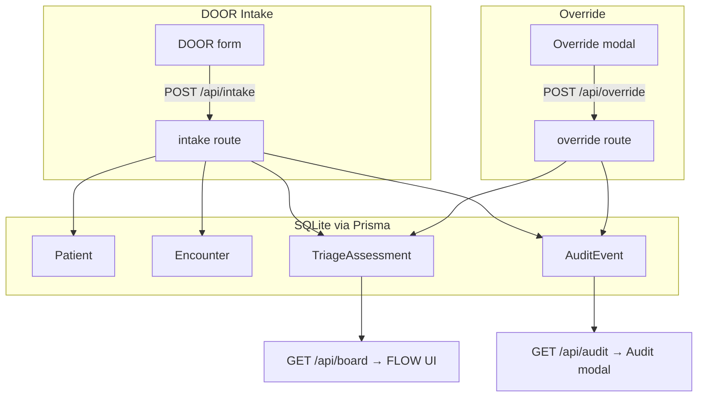

# Data Flow — Intake, Override & Audit

Where data goes when you use DOOR, Accept, Override, and Audit.

Database file (local demo): `apps/web/prisma/dev.db` (SQLite).

---

## Overview

---

## DOOR Accept flow

1. **UI** sends `POST /api/intake` with name, age, complaint, vitals, `languageBarrier`, etc.
2. **`Patient`** row created (`externalId` = `INTAKE-{timestamp}`, `displayName` = name you entered).
3. **`Encounter`** row created (`chiefComplaint`, `vitalsJson`, `status: waiting`).
4. **`assessEncounter()`** runs triage engine → new **`TriageAssessment`** (`source: ENGINE`).
5. **`AuditEvent`** `INTAKE_CREATED` with name, complaint, age, ESI, bucket.
6. **`AuditEvent`** `SCORE_ISSUED` (from assess step) with patient name + scores.
7. **FLOW board** reads latest assessment per encounter → shows acuity pill, route, detail panel.

**Vitals** stored in `Encounter.vitalsJson` and shown in Patient Detail as “Vitals at intake”.

---

## DOOR Override flow

1. **Intake runs first** (same as above) — patient exists on board.
2. **Override modal** sends `POST /api/override` with `encounterId`, `newEsi`, `reasonCode`, `note`.
3. **New `TriageAssessment`** row created (`source: OVERRIDE`, `previousEsi`, `overrideReasonCode`, `overrideNote`).
   - Old assessment rows are **kept** (history in DB; UI shows latest only).
4. **`Encounter.lastAssessedAt`** updated.
5. **`AuditEvent`** `OVERRIDE` with patient name, complaint, ESI before/after, reason, note.
6. Board refreshes → FLOW shows **new** ESI and “Clinician override” tag.

---

## FLOW override (existing patient)

Same as steps 2–6 above; no new intake.

---

## Audit trail UI

- `GET /api/audit` returns `AuditEvent` rows.
- `apps/web/src/lib/audit-display.ts` formats summaries for display.
- Click row in UI to expand full payload (no separate table — reads `payloadJson`).

---

## What is NOT changed on override

| Field | Changes? |
|-------|----------|
| Patient name | No |
| Vitals on encounter | No (unless `PUT /api/watch`) |
| Chief complaint | No |
| Prior engine assessment rows | No — retained as history |

---

## Package note (developers)

- Browser UI imports `@acuity/triage-engine` (scoring only — no Node `fs`).
- Benchmark CLI uses `@acuity/triage-engine/evaluate` or `npm run evaluate`.

See [ARCHITECTURE.md](ARCHITECTURE.md) for API list.
